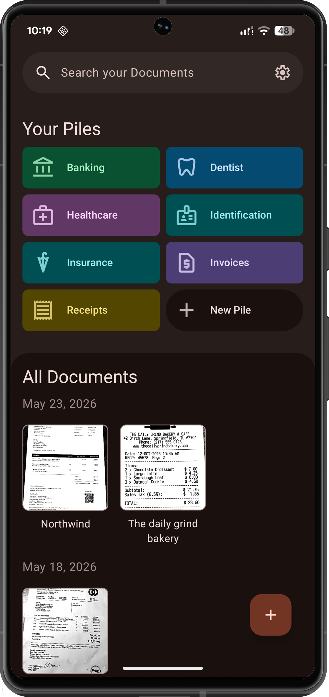
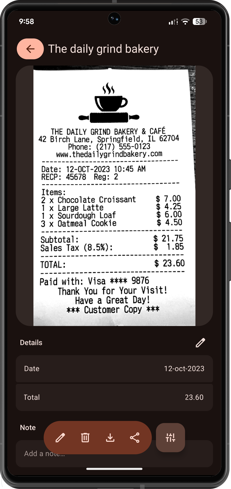
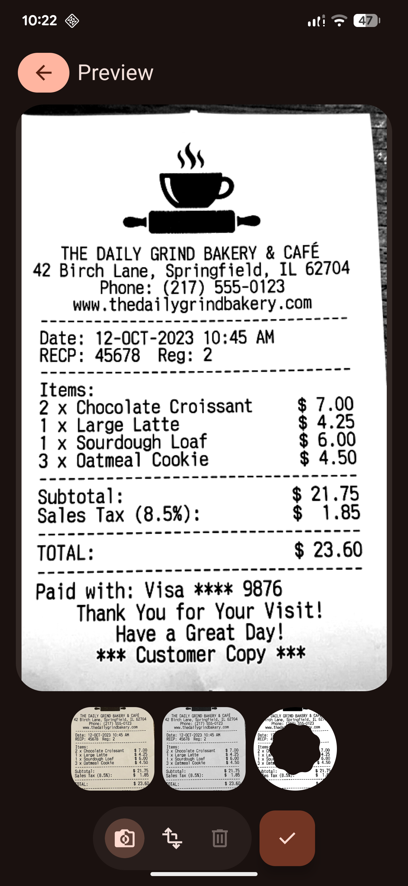

# Pile

Pile is an application focused on centralized document management, designed to make personal files easier to organize, access and share. Featuring a unique tag-based system called **piles**!

The project is built with **Kotlin** and **Jetpack Compose**, following a **Clean architecture + MVI / UDF** approach, with a strong focus on maintainability, scalability and modern Android development practices.

> 🚧 This project is currently under active development.

## Screenshots

<p align="center">



</p>


## Features

- Centralized document management
- Tags for easy document management
- Modern Material expressive design
- Local persistence for storing and retrieving document data
- Reactive state management using Coroutines and Flow
- Full PDF support
- Built-in search


## Tech Stack

- **Kotlin**
- **Jetpack Compose** with **Material 3 Expressive**
- **MVI / UDF** (Unidirectional Data Flow)
- **Koin** for dependency injection
- **SQLDelight** for local persistence
- **Kotlin Coroutines**
- **Kotlin Flow**
- **Navigation 3**
- **Napier** for logging


### Why these technologies?

- **Jetpack Compose** was chosen to build a modern UI following the recomended guidelines from Google.
- **Koin** was selected as the dependency injection framework due to its lightweight setup and compatibility with Kotlin Multiplatform-oriented projects.
- **SQLDelight** was chosen over Room because of its strong SQL-first approach and multiplatform compatibility, which keeps the project open to future KMP evolution.
- **Coroutines + Flow** provide a clean and reactive way to handle asynchronous work and UI state updates.


## Architecture

Pile follows a **feature-based modular architecture** combined with **Clean Architecture** principles.

The codebase is organized into two main areas:

- **`core/`** — Shared code used across the entire application:
    - Common data sources, repositories and utilities
    - Shared domain models and base use cases
    - Global dependency injection modules
    - Reusable UI components, app theme and navigation
- **`features/`** — Each feature is self-contained and follows its own Clean Architecture layering:
    - **`data/`** — Feature-specific data sources and helpers
    - **`domain/`** — Feature-specific models and use cases
    - **`ui/`** — Compose screens, view models and feature-scoped composables
    - **`di/`** — Feature-scoped Koin modules

This structure keeps each feature isolated, easier to maintain, and ready for a potential migration to fully independent Gradle modules in the future.


## Project Structure

```
app/
 ├── core/              # Shared infrastructure
 │   ├── activities/    # Global Activity management
 │   ├── data/          
 │   ├── di/
 │   ├── domain/        
 │   └── ui/            # Reusable UI & Utilities
 │
 └── features/          # Self-contained features
     └── search/        # Example feature
         ├── data/
         ├── di/
         ├── domain/    
         └── ui/        # UI Contract, Screen and ViewModel
```

> The exact package structure may evolve as the project grows.


## Current status

Pile is a personal project under continuous improvement.

At the moment, the main focus is:

- Stabilizing the current feature set
- Improving UX across the whole application
- Polishing document-related interactions
- Reducing bugs and edge-case failures


## Roadmap

Planned next steps for the project include:

- [ ]  Improve overall stability and error handling
- [ ]  Improve document import and sharing flows
- [ ]  Refine UI/UX details across the app
- [ ]  Add local AI-assisted document information extraction
- [ ]  Add backup options
- [ ]  Continue evolving the architecture with multiplatform support

### Future AI integration

One of the planned features for Pile is local AI-powered document information extraction. The goal is to help users automatically identify important data from their files while keeping the experience privacy-friendly and device-oriented.

This feature is still in the research and design stage.


## Known limitations

As the project is still evolving, these areas are not fully polished:

- Some flows may require additional validation and error handling
- UI details and consistency are still being improved
- Test coverage is currently limited
- Some planned features are not implemented yet


## Getting Started

### Requirements

- Android Studio (latest stable version recommended)
- JDK 17 or higher (JDK 21 recommended)
- Android SDK configured

### Setup

1. Clone the repository:

```bash
git clone https://github.com/rubenalfon/Pile.git
```

2. Open the project in Android Studio
3. Sync Gradle and run the app 


## Development Notes

Pile is also a learning and experimentation project where I apply modern Android development practices, especially around:

- Compose-first UI development
- Architectural separation of concerns
- Local persistence
- Reactive programming with Flow
- Dependency injection
- Preparing apps for future multiplatform scenarios


## Author

**Rubén Alfonso**

If you want to connect or discuss the project, feel free to reach out through GitHub.


## License

This project is licensed under the **Apache License 2.0**.

See the [LICENSE](./LICENSE) file for full details.

```
Copyright 2025 Rubén Alfonso

Licensed under the Apache License, Version 2.0 (the "License");
you may not use this file except in compliance with the License.
You may obtain a copy of the License at

    http://www.apache.org/licenses/LICENSE-2.0
```
